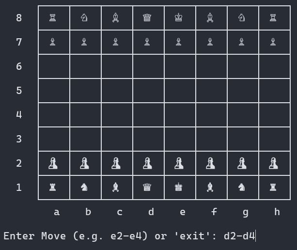

# unicode-chess
Simple Unicode Chess in terminal. No AI, No move Restrictions, No Auto Castling, and etc. Just pure manual chess in terminal.

Made from scratch for a final project in our subject.

-- Aldrsze.
---
### Screenshots

